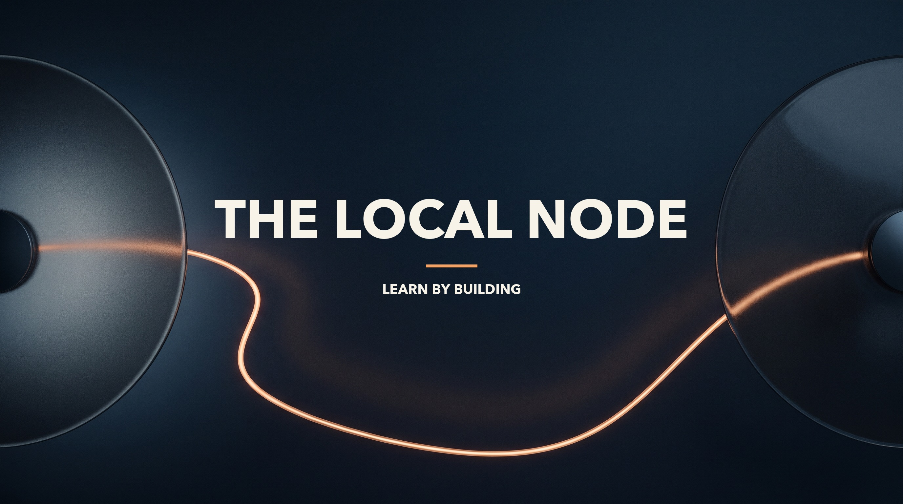
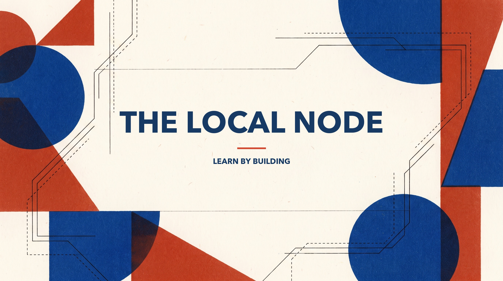
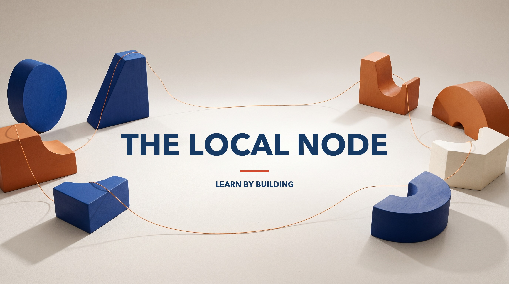

# Brand artwork

Six directions are available in `concepts/`. Signal, Workshop, and Atlas are the first round. Relay, Folio, and Modules are the second round. Each has a clean Gemini background and a `-banner.jpg` title preview; the second round also has a `-youtube.jpg` channel banner. The text is added by `render.py`, so the background can be reused for future tracks and video assets.

| Direction | GitHub / README preview | YouTube channel preview |
| --- | --- | --- |
| Relay · dark and luminous |  | [Open YouTube preview](concepts/relay-youtube.jpg) |
| Folio · graphic print |  | [Open YouTube preview](concepts/folio-youtube.jpg) |
| Modules · physical objects |  | [Open YouTube preview](concepts/modules-youtube.jpg) |

`generate.mjs` stores the prompts and uses Gemini Pro Image for the second round. With `GEMINI_API_KEY` in your environment, run `node assets/brand/generate.mjs relay folio modules` to generate missing backgrounds. It skips existing files. Never put the key in this repository.

The source backgrounds are 16:9, so they can also be cropped for YouTube thumbnails. The supplied YouTube channel previews are 2560 × 1440, with text inside the central 1546 × 423 safe area. Keep thumbnail titles as separate layers so each video can have its own short, specific message.

To redraw the supplied title previews, install Pillow and run `python3 assets/brand/render.py` from the repository root. The supplied images are ready to use without these tools.
